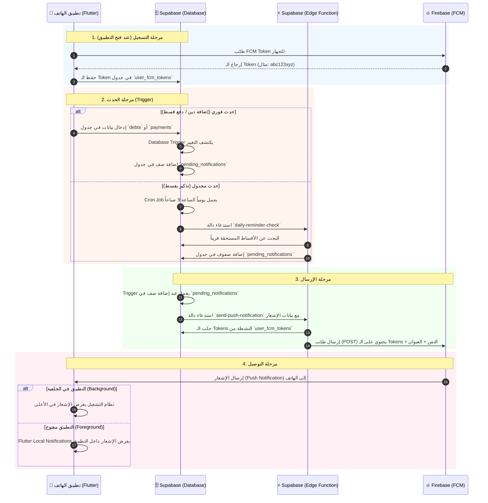

# 🔔 دورة حياة الإشعارات في تطبيق ديبتي (Debity)

يشرح هذا المستند كيف تعمل الإشعارات (Push Notifications) في التطبيق، وكيف تتواصل المكونات الثلاثة الرئيسية: **تطبيق الهاتف (Flutter)**، **قاعدة البيانات (Supabase)**، و **خدمة الإشعارات (Firebase)**.

---

## 🏗️ المكونات الرئيسية

1. **📱 تطبيق الهاتف (Flutter App)**: واجهة المستخدم، يستقبل الإشعارات ويعرضها.
2. **🗄️ Supabase**: العقل المدبر، يحتوي على قاعدة البيانات، الجداول، الـ Triggers، والـ Edge Functions.
3. **🔥 Firebase Cloud Messaging (FCM)**: ساعي البريد، الخدمة المسؤولة عن توصيل الإشعار الفعلي إلى هاتف المستخدم.

---

## 🔄 المخطط التوضيحي (Mermaid Diagram)

---

## 📝 شرح الخطوات بالتفصيل

### 1. مرحلة التسجيل (Registration)
عندما يقوم المستخدم بفتح التطبيق وتسجيل الدخول:
- يطلب التطبيق من Firebase إعطاءه "رقم تعريف فريد" لهذا الهاتف يُسمى **FCM Token**.
- يقوم التطبيق بإرسال هذا الـ Token إلى Supabase ليتم حفظه في جدول `user_fcm_tokens`.
- *الهدف:* لكي يعرف Supabase لاحقاً "أين" يرسل الإشعار.

### 2. مرحلة الحدث (Triggering)
كيف يقرر النظام أن هناك إشعار يجب إرساله؟ هناك طريقتان:
- **أحداث فورية:** عندما يقوم المستخدم بإضافة دين جديد أو تسجيل دفعة، يتم حفظ ذلك في الجداول (`debts` أو `payments`). يوجد "مراقب" (Database Trigger) يلاحظ هذا التغيير ويقوم فوراً بإنشاء "طلب إشعار" في جدول `pending_notifications`.
- **أحداث مجدولة (التذكير بالأقساط):** يوجد منبه (Cron Job) في Supabase يعمل كل يوم الساعة 9 صباحاً. يقوم بتشغيل دالة (`daily-reminder-check`) تبحث في جدول الأقساط (`installments`) وتقارنه بإعدادات المستخدم (`notification_settings`). إذا وجد قسطاً اقترب موعده، يقوم بإنشاء "طلب إشعار" في جدول `pending_notifications`.

### 3. مرحلة الإرسال (Sending)
بمجرد إضافة أي صف جديد في جدول `pending_notifications`:
- يعمل "مراقب" آخر (Trigger) فوراً.
- يقوم هذا المراقب باستدعاء دالة سحابية (Edge Function) اسمها `send-push-notification`.
- تقوم هذه الدالة بجلب الـ FCM Tokens الخاصة بالمستخدم من قاعدة البيانات.
- ثم تتصل بـ Firebase (باستخدام الـ `FCM_SERVICE_ACCOUNT` السري) وتقول له: "أرسل هذا العنوان وهذا النص إلى هذه الهواتف".

### 4. مرحلة التوصيل (Delivery)
- يستلم Firebase الطلب ويقوم بإرسال الإشعار عبر الإنترنت إلى هاتف المستخدم.
- إذا كان التطبيق مغلقاً أو في الخلفية، سيظهر الإشعار في شريط الإشعارات العلوي للهاتف.
- إذا كان التطبيق مفتوحاً أمام المستخدم، سيقوم كود Flutter (تحديداً `FlutterLocalNotifications`) بالتقاط الإشعار وعرضه كرسالة منبثقة داخل التطبيق.